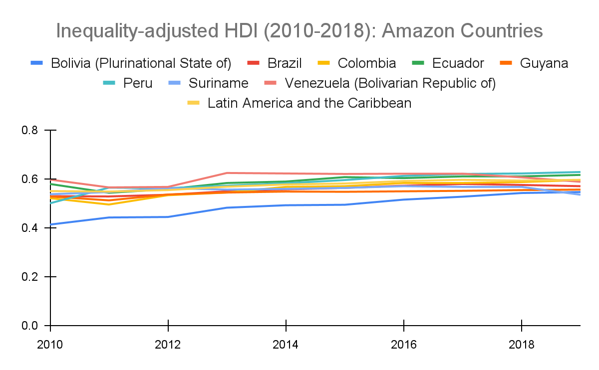

# The Inequality-Adjusted HDI, 2010–2018

**Source:** UN Statistics Department, 2020

## What this indicator measures

Adjusts the HDI for inequalities in the same three basic dimensions of human development.

## Key finding

All Amazon countries show gender inequality is evident in the achievement of health, knowledge and standard of living, resulting in a negative adjustment to human development trends.

## Visual

## Full reference

UN Statistics Department. (2020). *Interactive Dashboard: Human Development and the Anthropocene | Human Development Reports*. Human Development Reports. https://hdr.undp.org/en/dashboard-human-development-anthropocene
