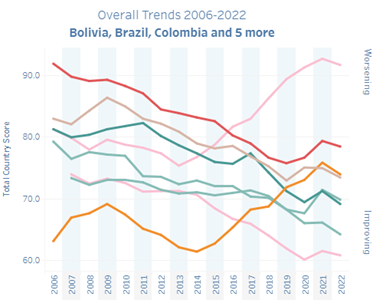
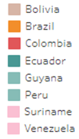

# Fragile State Index

**Source:** Fund For Peace, 2022

## What this indicator measures

Measures the social, economical and political pressures that all states experience against a state's capacity to manage those pressures. Based on 12 indicators including human rights, press freedom, civil liberties, and political prisoners.

## Key finding

Venezuela and Brazil have been on a worsening trend since 2013 and 2014 respectively. In 2019, they had the most worsening trends globally. Colombia has also been on a worsening trend since 2019. All Amazon countries improved in 2022 compared to 2021.

## Visual

## Full reference

Fund for Peace. (2022). *Fragile States Index*. https://fragilestatesindex.org/
