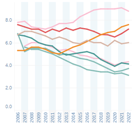

# Human Rights Protection, 2006–2019

**Source:** Herre & Roser, 2016

## What this indicator measures

Scores capturing the extent to which citizens' physical integrity is protected from government killings, torture, political imprisonments, extrajudicial executions, mass killings and disappearances. Higher scores mean fewer such abuses.

## Key finding

Brazil, Colombia and Venezuela have below average human rights protection. Brazil and Venezuela have trended downward — a rise in reported physical integrity abuse. Suriname, Guyana, Peru and Ecuador show better than world average human rights protection. Bolivia has declined since 2017. Colombia has been trending upward significantly since 2006.

## Visual

## Full reference

Herre, B., & Roser, M. (2016). Human Rights. *Our World in Data*. https://ourworldindata.org/human-rights
