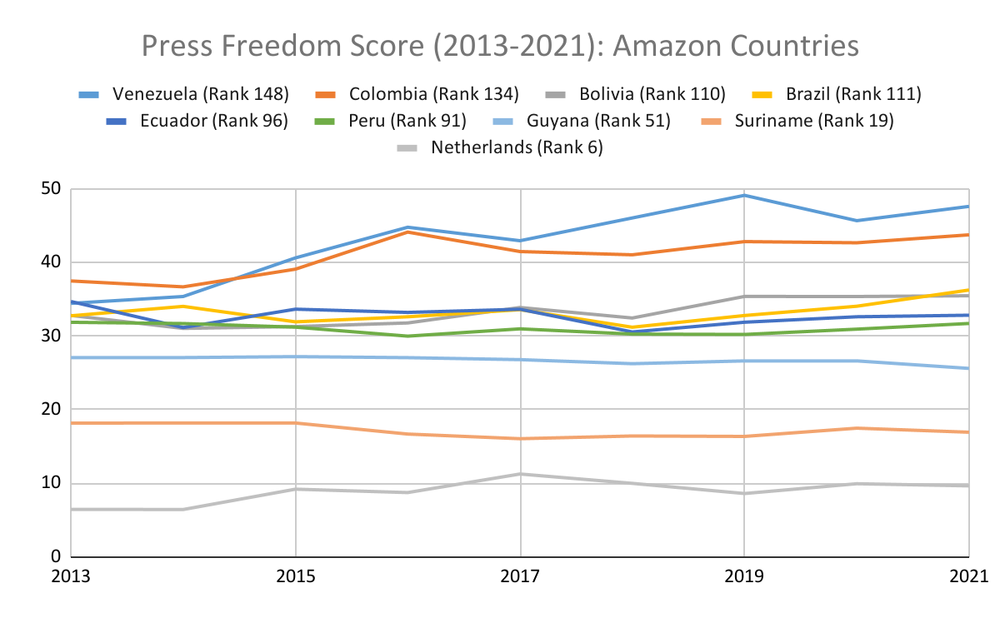

# Press Freedom Score

**Source:** Reporters Sans Frontiers, 2022

## What this indicator measures

Measures the level of freedom available to journalists in each country. Calculated by Reporters Sans Frontières based on an evaluation of pluralism, independence of the media, quality of legislative framework and safety of journalists. Lower score = more journalistic freedom.

## Key finding

Not specified in available text — visual required for key finding.

## Visual

## Full reference

Reporters Sans Frontiers. (2022). *World Press Freedom Score*. https://rsf.org/en/index-methodologie-2022
