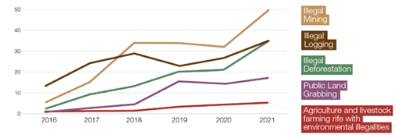

# Illegal Activities Targeted by Federal Police in the Brazilian Amazon

**Source:** Trajber Waisbich et al., 2022

## What this indicator measures

Data collected from 369 operations carried out by the Federal Police. Categories include illegal mining, illegal logging, public land grabbing, and illegal agriculture and farming.

## Key finding

The number of police operations against illegal activities in the Amazon increased, indicating an increase of these activities (though technology improvements have made detection easier). 53% of the area deforested in Mato Grosso in 2019 and 2020 remains without any action for enforcement or liability identified.

## Visual

## Full reference

Trajber Waisbich, L., Risso, M., Husek, T., & Brasil, L. (2022). *The ecosystem of environmental crime in the Amazon* (Strategic Paper No. 55). Igarapé Institute. https://igarape.org.br/wp-content/uploads/2022/04/The-ecosystem-of-environmental-crime-in-the-Amazon.pdf
