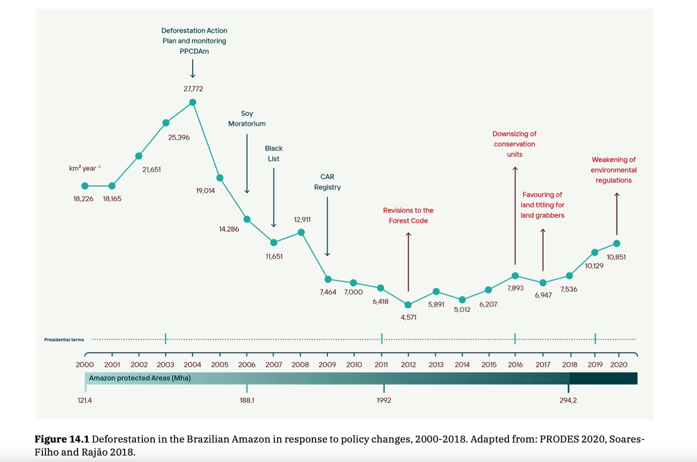

# Deforestation in Response to Policy Changes, 2000–2021

**Source:** Hecht et al., 2021

## What this indicator measures

Analysis of how important political and policy changes in Brazil led to dramatic declines in deforestation after a peak in 2004, and how subsequent policy reversals since 2016 have been accompanied by rising deforestation.

## Key finding

Annual deforestation rates in the Amazon dropped by approximately 80% from 2005 to 2012, due to commodity price decreases, unfavourable currency exchange rates, policy interventions, and significant institution development. By 2016, with political changes, deforestation began to climb again.

## Visual

## Full reference

Hecht, S., Schmink, M., Abers, R., Assad, E. D., Humphreys Bebbington, D., Brondizio, E. S., Costa, F. de A., Durán Calisto, A. M., Fearnside, P., Garrett, R., Heilpern, S., McGrath, D., Oliveira, G., Pereira, H., & Pinedo-Vazquez, M. (2021). Chapter 14: Amazon in Motion. In *Amazon Assessment Report 2021* (1st ed.). UN Sustainable Development Solutions Network (SDSN). https://doi.org/10.55161/NHRC6427
