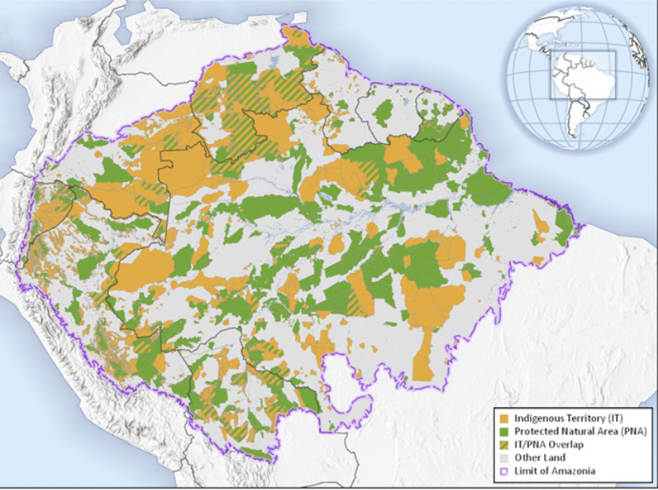

# Indigenous Territories and Protected Natural Areas, 2016

**Source:** Walker et al., 2020

## What this indicator measures

Map of Indigenous Territories (ITs/IPLC Lands, orange) and Protected Natural Areas (PNAs, green) across the nine-nation region contained within the biogeographic limit of the Amazon.

## Key finding

Indigenous Territories cover 30% of the Amazon land area. Around 87% of IPLCs/ITs have legal recognition. An estimated 1.7 million people live within approximately 3,344 indigenous territories and approximately 522 protected natural areas spanning 9 nations. Protected Natural Areas that do not overlap with Indigenous Territories contribute an additional 22% of coverage — a total of 52% coverage combined.

## Visual

## Full reference

Walker, W. S., et al. (2020). The role of forest conversion, degradation, and disturbance in the carbon dynamics of Amazon indigenous territories and protected areas. *Proceedings of the National Academy of Sciences*, *117*(6), 3015–3025. https://doi.org/10.1073/pnas.1913321117
