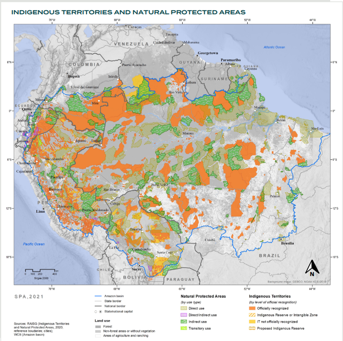

# Indigenous Territories and Protected Natural Areas — Including Unrecognised

**Source:** Science Panel for the Amazon, 2021

## What this indicator measures

Extended map including indigenous territories not yet formally recognised, showing broader coverage of IPLC lands across the Amazon.

## Key finding

Government concessions for mining and petroleum extraction overlap with nearly one-quarter (24%) of all recognized territorial lands. While Indigenous Lands are not designed with the intent to protect biodiversity, mitigate against climate change or keep anthropogenic pressures at bay, this is what they have achieved by default.

## Visual

## Full reference

Science Panel for the Amazon. (2021). *Amazon Assessment Report 2021*. UN Sustainable Development Solutions Network (SDSN). https://doi.org/10.55161/RWSX6527
