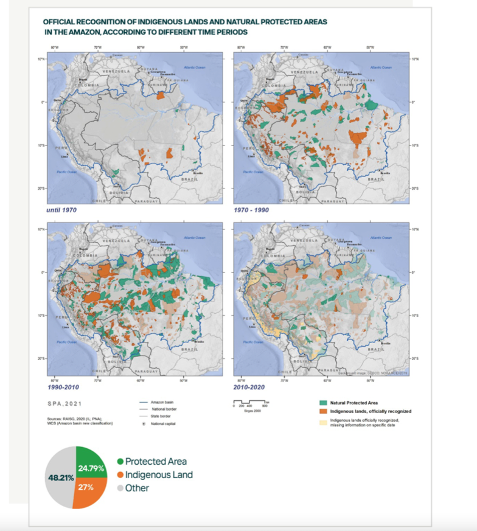

# Temporal Trend of Recognition of Indigenous Land and Gazettement of Natural Protected Areas

**Source:** Josse et al., 2021

## What this indicator measures

Chart showing the rate of establishment of protected areas and recognition of indigenous land over time across the Amazon region.

## Key finding

The main increase in protected areas and recognised indigenous land happened between 1990 and 2010. The last 10 years saw less increase in both.

## Visual

## Full reference

Josse, C., de Melo Futada, S., von Hildebrand, M., Moreno de los Ríos, M., Oliveira-Miranda, M. A., de Moraes Tenório, E. N., & Tuesta, E. (2021). Chapter 16: The state of conservation policies, protected areas, and Indigenous territories. In *Amazon Assessment Report 2021* (1st ed.). UN Sustainable Development Solutions Network (SDSN). https://doi.org/10.55161/KZLB5335
