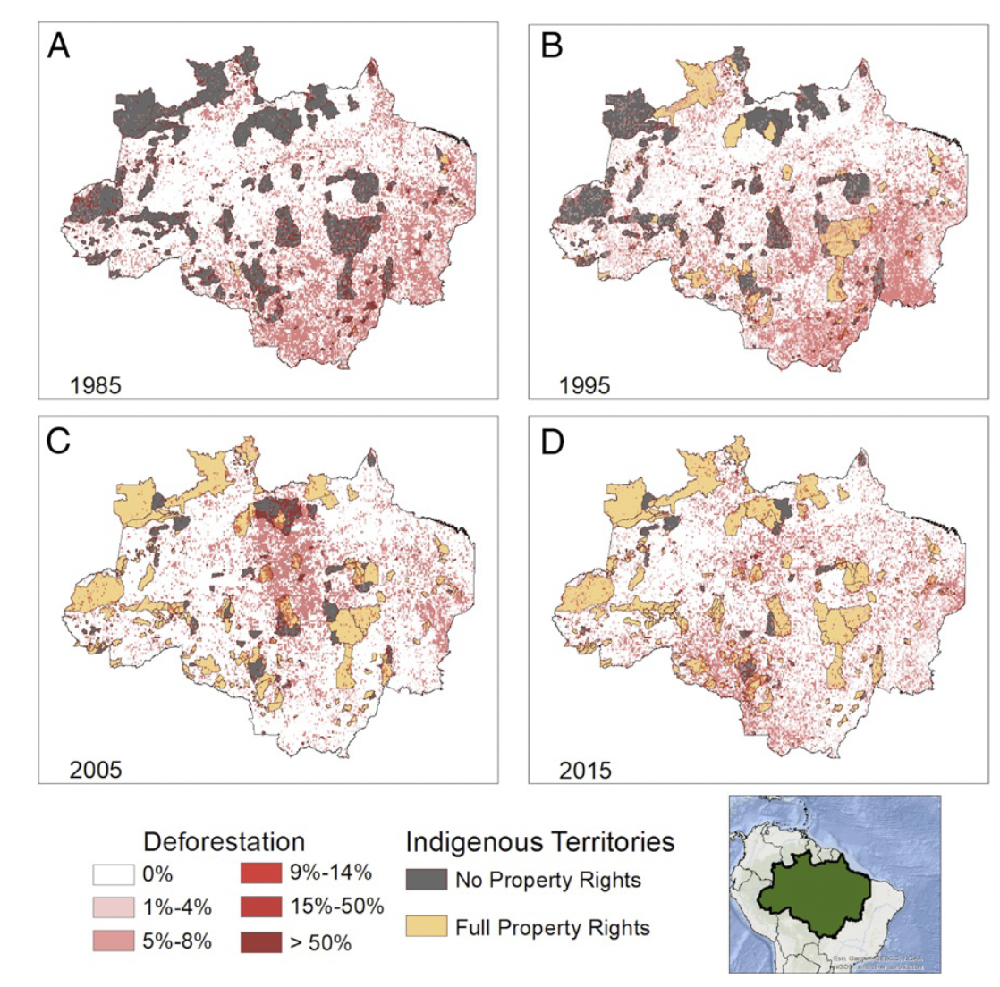

# The Effect of Property Rights on Deforestation, 1985–2015

**Source:** Baragwanath & Bayi, 2020

## What this indicator measures

Study examining how secure property rights for indigenous territories affect rates of deforestation.

## Key finding

Indigenous territories with full property rights are more effective in curbing deforestation. All Brazilian presidents, except for the last two (Temer and Bolsonaro), have homologated indigenous territory, regardless of their party or ideology.

## Visual

## Full reference

Baragwanath, K., & Bayi, E. (2020). Collective property rights reduce deforestation in the Brazilian Amazon. *Proceedings of the National Academy of Sciences*, *117*(34), 20495–20502. https://doi.org/10.1073/pnas.1917874117
