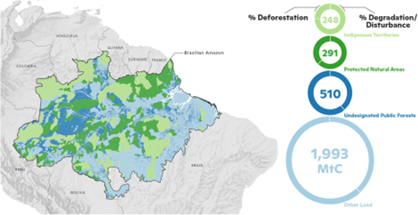

# Deforestation and Forest Degradation in Different Tenure Types in the Brazilian Amazon, 2003–2019

**Source:** Kruid et al., 2021

## What this indicator measures

Analysis of deforestation and forest degradation rates across different land tenure types in the Brazilian Amazon: indigenous territories, protected natural areas, and other lands.

## Key finding

Indigenous territories have the lowest carbon emissions and comparatively low deforestation.

## Visual

## Full reference

Kruid, S., Macedo, M. N., Gorelik, S. R., Walker, W., Moutinho, P., Brando, P. M., Castanho, A., Alencar, A., Baccini, A., & Coe, M. T. (2021). Beyond Deforestation: Carbon Emissions From Land Grabbing and Forest Degradation in the Brazilian Amazon. *Frontiers in Forests and Global Change*, *4*, 645282. https://doi.org/10.3389/ffgc.2021.645282
