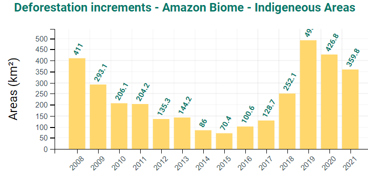

# Deforestation in Indigenous Areas in Brazil Amazon, 2008–2021

**Source:** INPE, 2022

## What this indicator measures

Annual deforestation rates within indigenous areas of the Brazilian Amazon, 2008–2021.

## Key finding

After several years of increase, deforestation is declining in indigenous areas of the Brazilian Amazon.

## Visual

## Full reference

National Institute for Space Research, Earth Observation General Coordination (INPE). (2022). *PRODES: Deforestation of the Brazilian Amazon*. https://www.inpe.br/
