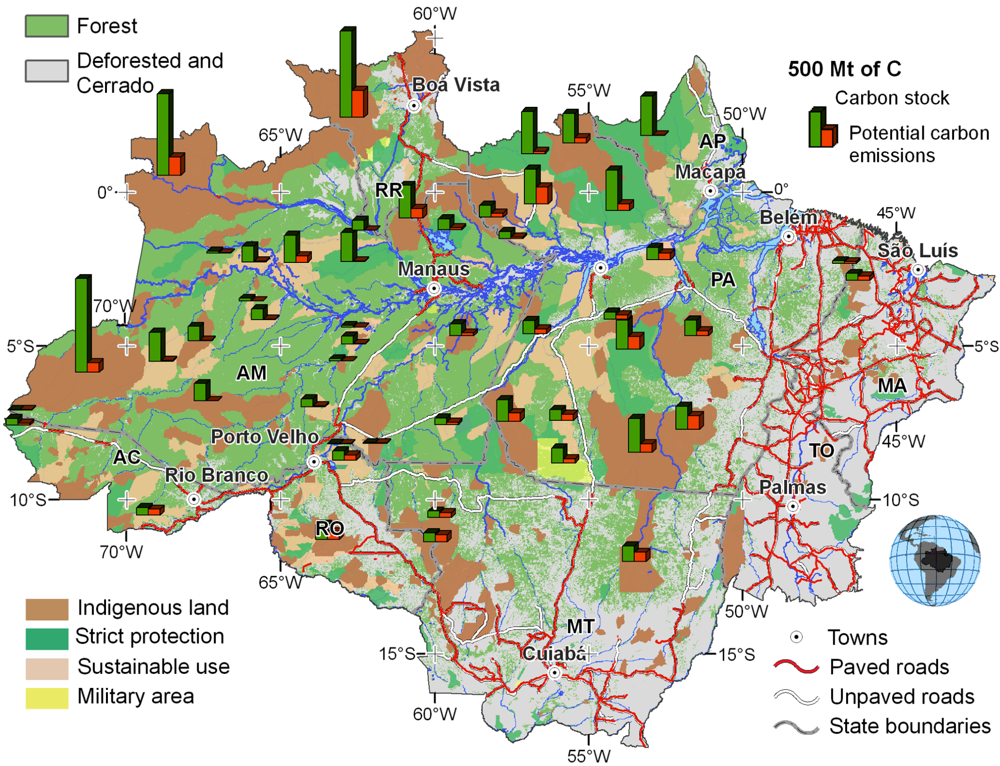

# Carbon Stocks and Potential Emissions of Selected ILPAs in the Brazilian Amazon

**Source:** Ricketts et al., 2010

## What this indicator measures

Potential emissions estimated by simulating future deforestation through 2050, with and without Indigenous Lands and Protected Areas (ILPAs) present. The difference (orange bars) represents the reductions of CO2 emissions contributed by each ILPA.

## Key finding

Indigenous lands reduce carbon emissions, but they are not always deforestation free, often because of weak capacity.

## Visual

## Full reference

Ricketts, T. H., et al. (2010). Indigenous Lands, Protected Areas, and Slowing Climate Change. *PLoS Biology*, *8*(3), e1000331. https://doi.org/10.1371/journal.pbio.1000331
