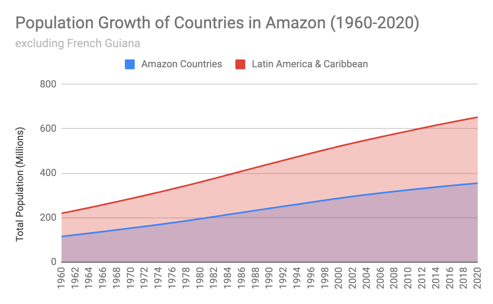

# Population Growth, 1960–2020

**Source:** UN Statistics Department, 2020

## What this indicator measures

Population growth trends for countries in the Amazon region between 1960 and 2020.

## Key finding

Population of countries in the Amazon account for 54.5% of the total population of Latin America and the Caribbean.

## Visual

## Full reference

UN Statistics Department. (2020). *Interactive Dashboard: Human Development and the Anthropocene | Human Development Reports*. Human Development Reports. https://hdr.undp.org/en/dashboard-human-development-anthropocene
