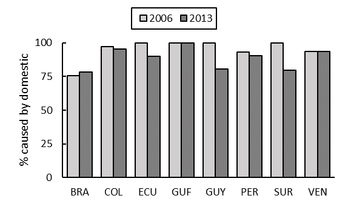

# Deforestation Driven by Domestic Consumption versus Exports

**Source:** Pendrill et al., 2019; Ritchie & Roser, 2021

## What this indicator measures

Land-balance model attributing detected forest loss across the world to the expansion of croplands, pasture and tree plantations, then linking this to particular agricultural commodities based on national land use, crop and forest product statistics. Note: delayed deforestation is not included, which makes the data less meaningful for Amazon countries, as soy expansion often happens on former grassland, pushing cattle ranchers into the forest.

## Key finding

In all Amazon countries with data available, the major share of deforestation is attributed to domestic consumption, with little variation between 2006 and 2013. For Suriname and Guyana, the share of deforestation from exports increased by about 20% each. In 2013, 72% of Brazil's deforestation was attributed to cattle ranchers and 10% to soybean expansion.

## Visual

## Full reference

Pendrill, F., et al. (2019). Deforestation displaced: Trade in forest-risk commodities and the prospects for a global forest transition. *Environmental Research Letters*, *14*(5), 055003. https://doi.org/10.1088/1748-9326/ab0d41

Ritchie, H., & Roser, M. (2021). Drivers of Deforestation. *Our World in Data*. https://ourworldindata.org/drivers-of-deforestation
