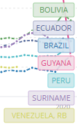
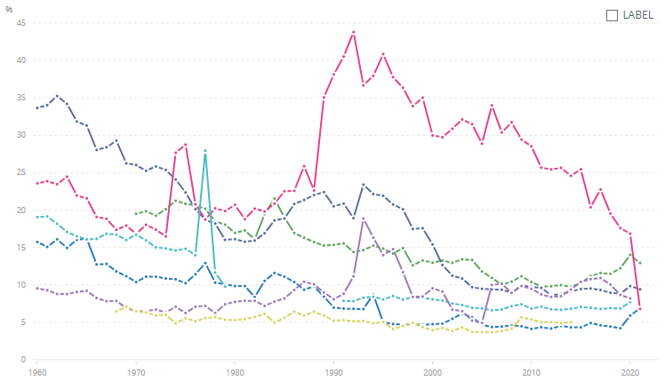

# Agriculture, Forestry, and Fishing Value Added (% of GDP), 1960–2021

**Source:** World Bank, 2021

## What this indicator measures

Value added by agriculture, forestry and fishing as a percentage of GDP across Amazon countries, 1960–2021.

## Key finding

For all countries within the Amazon, the relative value added to GDP by agriculture, forestry and fisheries has decreased over the years. In 2021, it was highest for Bolivia (12.9%), followed by Ecuador (9.4%). The value is lowest for Brazil and Guyana (both 6.8%).

## Visual

## Full reference

World Bank. (2021). *World Bank Open Data*. https://data.worldbank.org/
