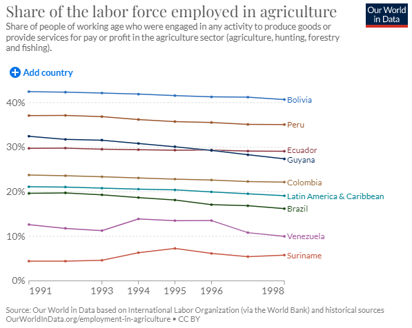

# Share of Labour Force Employed in Agriculture, 1991–2019

**Source:** Roser, 2013

## What this indicator measures

Share of labour force employed in agriculture across Amazon countries, 1991–2019.

## Key finding

Bolivia has the highest share of labour employed in agriculture. Brazil, Venezuela and Suriname are below the average share of Latin America and Caribbean countries.

## Visual

## Full reference

Roser, M. (2013). Employment in Agriculture. *Our World in Data*. https://ourworldindata.org/employment-in-agriculture
