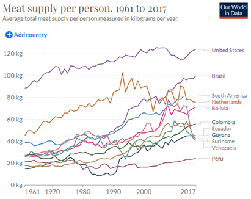

# Meat Supply in Amazon Countries, 1961–2017

**Source:** Ritchie et al., 2017

## What this indicator measures

Food supply of meat available for human consumption across Amazon countries. Excludes fish and seafood. Does not correct for waste at household level.

## Key finding

Meat consumption (as food) is high and increasing in Brazil. In the other Amazonian countries, meat consumption is lower — below the South American average and below, for example, the Netherlands.

## Visual

## Full reference

Ritchie, H., Rosado, P., & Roser, M. (2017). Meat and Dairy Production. *Our World in Data*. https://ourworldindata.org/meat-production
