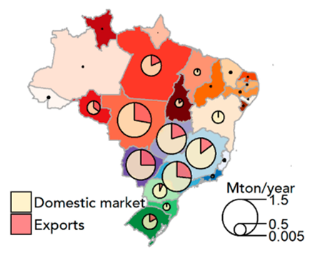

# Beef Production in Brazil by State, 2017

**Source:** zu Ermgassen et al., 2020

## What this indicator measures

Cattle production (Mtons/year) and proportion exported per state in Brazil, shown for 2017.

## Key finding

Beef production within the Brazilian Amazon is mostly for domestic consumption.

## Visual

## Full reference

zu Ermgassen, E. K. H. J., et al. (2020). The origin, supply chain, and deforestation risk of Brazil's beef exports. *Proceedings of the National Academy of Sciences*, *117*(50), 31770–31779. https://doi.org/10.1073/pnas.2003270117
