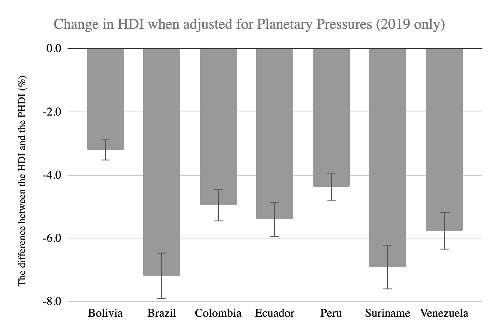

# The Planetary Pressures-Adjusted Human Development Index (PHDI), 2019

**Source:** UN Statistics Department, 2020

## What this indicator measures

Experimental index that adjusts the Human Development Index (HDI) for planetary pressures, namely CO2 emissions and material footprint per capita.

## Key finding

The HDI of all Amazon countries decreases when adjusted for planetary pressures. The largest decrease was recorded for Brazil and Suriname.

## Visual

## Full reference

UN Statistics Department. (2020). *Interactive Dashboard: Human Development and the Anthropocene | Human Development Reports*. Human Development Reports. https://hdr.undp.org/en/dashboard-human-development-anthropocene
