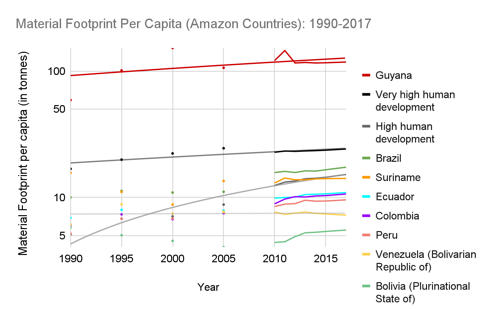

# Material Footprint Per Capita, 1990–2017

**Source:** UN Statistics Department, 2020

## What this indicator measures

Attribution of global material extraction to domestic final demand of a country, calculated as raw material equivalent of imports plus domestic extraction minus raw material equivalents of exports.

## Key finding

Guyana, Brazil and Suriname have the highest material footprint per capita among Amazon countries.

## Visual

## Full reference

UN Statistics Department. (2020). *Interactive Dashboard: Human Development and the Anthropocene | Human Development Reports*. Human Development Reports. https://hdr.undp.org/en/dashboard-human-development-anthropocene
