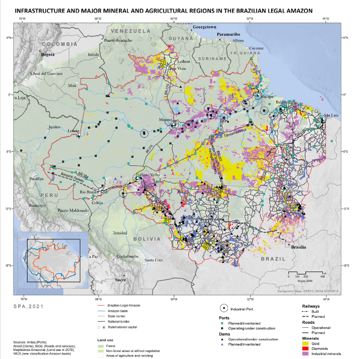

# Infrastructure and Major Mineral and Agricultural Regions and Projects in the Brazilian Legal Amazon

**Source:** Hecht et al., 2021

## What this indicator measures

Map of existing and planned infrastructure, mineral and agricultural projects in the Brazilian Legal Amazon.

## Key finding

Rising global demand for commodities (grains, beef, minerals, fossil fuels) and the imperative of regional and global integration are driving large-scale land-use change and dramatically reshaping the physical and human environment of the Amazon region.

## Visual

## Full reference

Hecht, S., Schmink, M., Abers, R., Assad, E. D., Humphreys Bebbington, D., Brondizio, E. S., Costa, F. de A., Durán Calisto, A. M., Fearnside, P., Garrett, R., Heilpern, S., McGrath, D., Oliveira, G., Pereira, H., & Pinedo-Vazquez, M. (2021). Chapter 14: Amazon in Motion. In *Amazon Assessment Report 2021* (1st ed.). UN Sustainable Development Solutions Network (SDSN). https://doi.org/10.55161/NHRC6427
