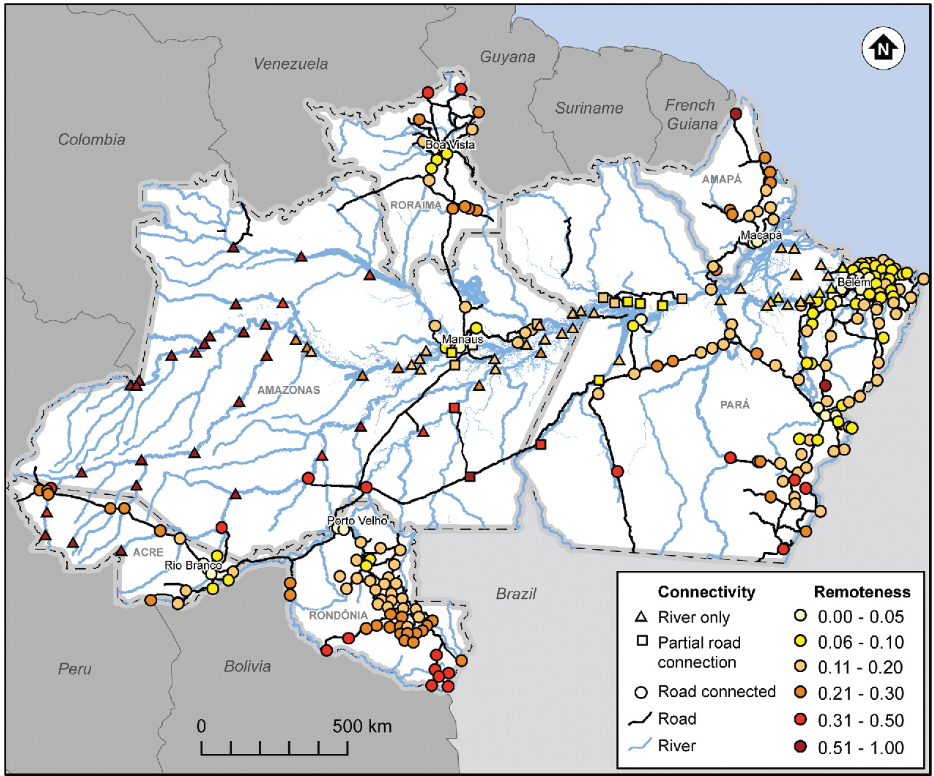

# Road Connectivity in the Brazilian Amazon

**Source:** Parry et al., 2018

## What this indicator measures

Map illustrating the Brazilian Amazon, road connectivity, and remoteness scores of 310 urban centres. Shows the road network (official and unofficial) and river network. Shapes indicate connectivity and colours indicate the level of remoteness.

## Key finding

914,654 people live in roadless urban centres. Floods pose a greater disease risk in less accessible urban centres because inadequate sanitation exposes inhabitants to environmental pollution and contaminated water. Places with the highest social vulnerability have the greatest natural and cultural assets.

## Visual

## Full reference

Parry, L., Davies, G., Almeida, O., Frausin, G., de Moraés, A., Rivero, S., Filizola, N., & Torres, P. (2018). Social Vulnerability to Climatic Shocks Is Shaped by Urban Accessibility. *Annals of the American Association of Geographers*, *108*(1), 125–143. https://doi.org/10.1080/24694452.2017.1325726
