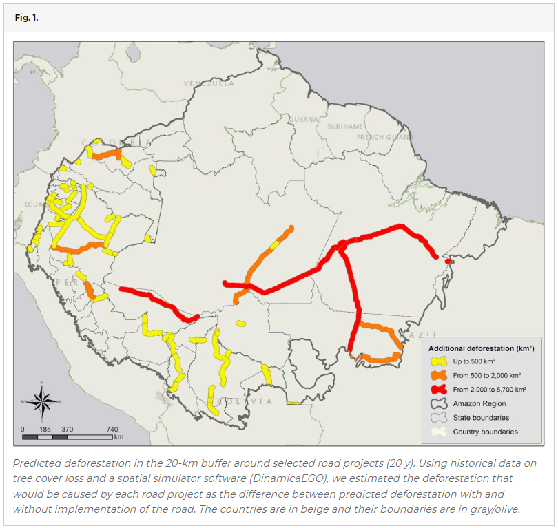

# Predicted Deforestation around Roads

**Source:** Vilela et al., 2020

## What this indicator measures

Predicted deforestation in the 20-km buffer around selected road projects over 20 years. Using historical data on tree cover loss and a spatial simulator software (DinamicaEGO), estimates the deforestation caused by each road project.

## Key finding

If all 75 proposed projects are implemented, they will cause deforestation of at least 2.4 million ha over the next 20 years — an area roughly equivalent to the land size of Belize. The planned projects in Brazil have the highest predicted deforestation. The set of proposed projects to improve Brazil's 2,234 km trans-Amazonian highway (BR-230) would cause forest cover loss of 561,000 ha or 23% of the total.

## Visual

## Full reference

Vilela, T., et al. (2020). A better Amazon road network for people and the environment. *Proceedings of the National Academy of Sciences*, *117*(13), 7095–7102. https://doi.org/10.1073/pnas.1910853117
