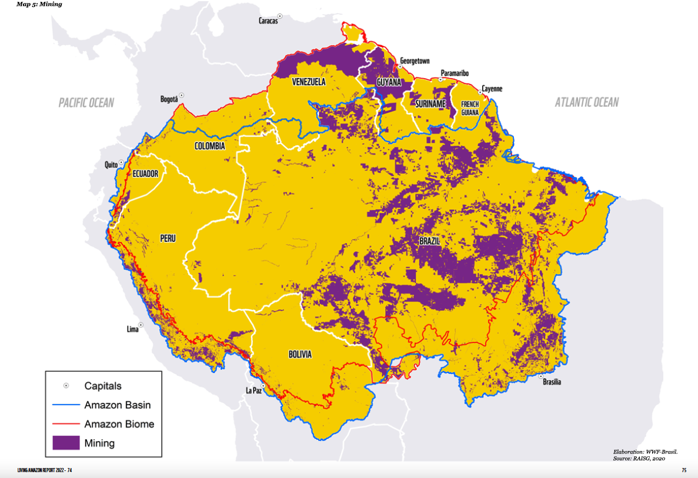

# Mining Areas in the Amazon, 2020

**Source:** Vergara et al., 2022

## What this indicator measures

Map of mining areas across the Amazon basin in 2020.

## Key finding

45,065 mining concessions either under operation or waiting for approval, of which 21,536 overlap with protected areas and indigenous land (48%).

## Visual

## Full reference

Vergara, A., et al. (2022). *Living Amazon Report 2022*. WWF.
