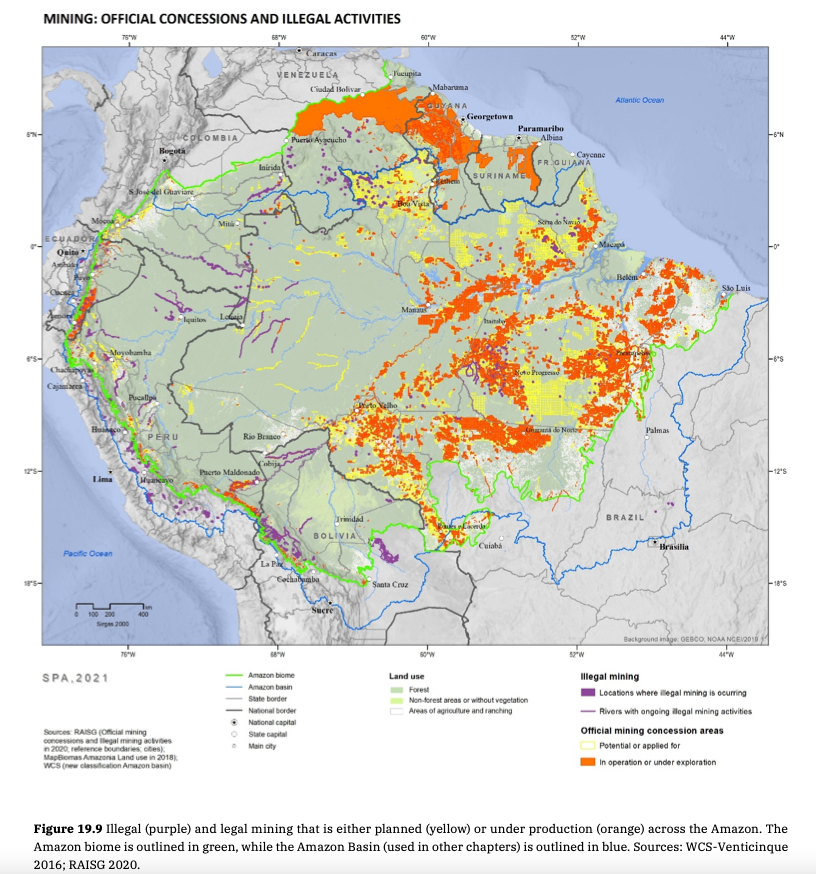

# Legal and Illegal Mining, 2020

**Source:** Berenguer et al., 2021

## What this indicator measures

Map showing illegal (purple) and legal mining that is either planned (yellow) or under production (orange) across the Amazon.

## Key finding

Gold mining is largely illegal. Despite its illegality, gold mining has become far from artisanal, and is now a semi-mechanised activity. The extent of mining-driven deforestation is far smaller than that caused by agricultural expansion. However, it still represents the main driver of forest loss in French Guiana, Guyana, Suriname and parts of Peru.

## Visual

## Full reference

Berenguer, E., Armenteras, D., Lees, A. C., Smith, C. C., Fearnside, P., Nascimento, N., Alencar, A., Almeida, C., Aragão, L. E. O., Barlow, J., Bilbao, B., Brando, P. M., Bynoe, P., Finer, M., Flores, B. M., Jenkins, C. N., Silva Junior, C. H. L., Souza, C., & García-Villacorta, R. (2021). Chapter 19: Drivers and ecological impacts of deforestation and forest degradation. In *Amazon Assessment Report 2021* (1st ed.). UN Sustainable Development Solutions Network (SDSN). https://doi.org/10.55161/AIZJ1133
