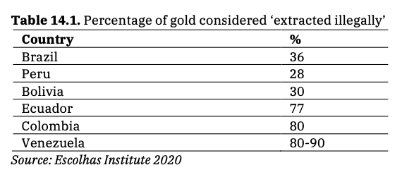

# Percentage of Gold Extracted Illegally

**Source:** Hecht et al., 2021

## What this indicator measures

Chart showing the proportion of gold extracted illegally in Amazonian countries.

## Key finding

Significant proportions of the gold extracted in Amazonian countries is extracted illegally. Peru is the largest gold producer in Latin America and the seventh largest in the world, yet over half of Peruvian gold is extracted by unregulated artisanal and small-scale gold mining.

## Visual

## Full reference

Hecht, S., Schmink, M., Abers, R., Assad, E. D., Humphreys Bebbington, D., Brondizio, E. S., Costa, F. de A., Durán Calisto, A. M., Fearnside, P., Garrett, R., Heilpern, S., McGrath, D., Oliveira, G., Pereira, H., & Pinedo-Vazquez, M. (2021). Chapter 14: Amazon in Motion. In *Amazon Assessment Report 2021* (1st ed.). UN Sustainable Development Solutions Network (SDSN). https://doi.org/10.55161/NHRC6427
