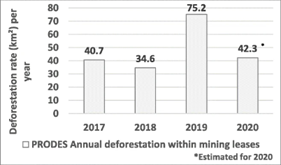
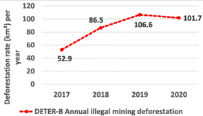

# Gold Mining and Deforestation in the Brazilian Amazon, 2017–2020

**Source:** Siqueira-Gay & Sánchez, 2021

## What this indicator measures

Analysis of the rate of illegal mining deforestation in the Brazilian Amazon from 2017 to 2020.

## Key finding

The rate of illegal mining deforestation increased more than 90% from 2017 to 2020, reaching 101.7 km2 annually in 2020 compared to 52.9 km2 annually in 2017. The illegal mining deforestation rate grew more than the rate of clearing within mining leases.

## Visual

## Full reference

Siqueira-Gay, J., & Sánchez, L. E. (2021). The outbreak of illegal gold mining in the Brazilian Amazon boosts deforestation. *Regional Environmental Change*, *21*(2), 28. https://doi.org/10.1007/s10113-021-01761-7
