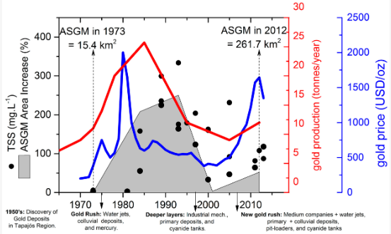

# Artisanal Gold Mining in Tapajós River Basin, Brazilian Amazon, 1970–2013

**Source:** Lobo et al., 2016

## What this indicator measures

Plot of the percentage of Artisanal and Small-scale Gold Mining (ASGM) for the whole Tapajós study area, along with total suspended solids concentration and gold production figures.

## Key finding

From 1990 to 2000, gold production decreased gradually due to a reduction in international gold prices. From mid-2000s to present, a new gold mining rush characterises this period, with an increase of 50% in ASGM from 2001 (171.7 km2) to 2012 (261.7 km2). A new period of industrial mining has emerged with large and expensive machinery.

## Visual

## Full reference

Lobo, F., Costa, M., Novo, E., & Telmer, K. (2016). Distribution of Artisanal and Small-Scale Gold Mining in the Tapajós River Basin (Brazilian Amazon) over the Past 40 Years and Relationship with Water Siltation. *Remote Sensing*, *8*(7), 579. https://doi.org/10.3390/rs8070579
