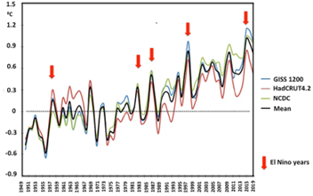

# Temperature Anomalies in the Amazon, 1949–2019

**Source:** Marengo et al., 2018

## What this indicator measures

Chart showing temperature anomalies across the Amazon basin between 1949 and 2019.

## Key finding

Surface temperature has increased by about 1°C between 1949 and 2019.

## Visual

## Full reference

Marengo, J. A., Souza, C. M., Thonicke, K., Burton, C., Halladay, K., Betts, R. A., Alves, L. M., & Soares, W. R. (2018). Changes in Climate and Land Use Over the Amazon Region: Current and Future Variability and Trends. *Frontiers in Earth Science*, *6*, 228. https://doi.org/10.3389/feart.2018.00228
