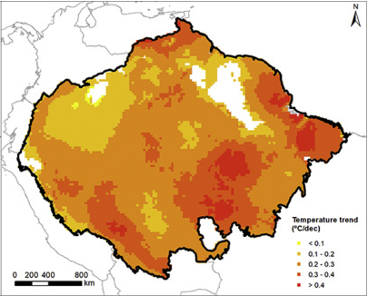
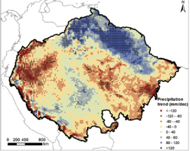

# Temperature and Precipitation Trends, 1982–2015

**Source:** Carvalho et al., 2020

## What this indicator measures

Trends of annual mean temperature and precipitation over the Amazon for 1982–2015. Trends not statistically significant in colourless areas according to the Mann-Kendall test.

## Key finding

The study found an average temperature increase of 0.2–0.3°C/decade. Regions with higher increases are mostly found in the southeast Amazon area. Significant decreasing trends in precipitation occur mainly in the western Amazon. Increasing trends were noticed in the north and northeast Amazon.

## Visual

## Full reference

Carvalho, S., Oliveira, A., Pedersen, J. S., Manhice, H., Lisboa, F., Norguet, J., de Wit, F., & Santos, F. D. (2020). A changing Amazon rainforest: Historical trends and future projections under post-Paris climate scenarios. *Global and Planetary Change*, *195*, 103328. https://doi.org/10.1016/j.gloplacha.2020.103328
