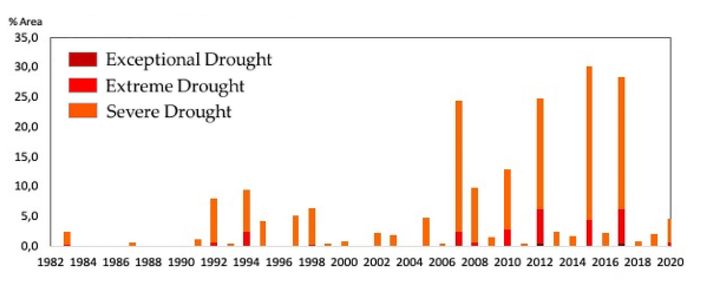

# Increased Climate Pressure on the Agricultural Frontier in the Eastern Amazonia–Cerrado Transition Zone

**Source:** Marengo et al., 2022

## What this indicator measures

Assessment of increasing climate pressure on the eastern Amazonia–Cerrado transition zone, one of the key regions for agricultural production in Brazil.

## Key finding

Severe drought conditions are increasing. As the region is one of the key regions for agricultural production in Brazil, an increased risk of climate-driven impacts could affect yields and potentially overall crop suitability. Changes already observed are critical and may put food security at risk.

## Visual

## Full reference

Marengo, J. A., Jimenez, J. C., Espinoza, J.-C., Cunha, A. P., & Aragão, L. E. O. (2022). Increased climate pressure on the agricultural frontier in the Eastern Amazonia–Cerrado transition zone. *Scientific Reports*, *12*(1), 457. https://doi.org/10.1038/s41598-021-04241-4
