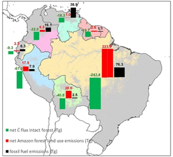
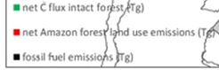

# Carbon Fluxes in the Amazon, 1980–2010

**Source:** Phillips et al., 2017

## What this indicator measures

Estimated carbon fluxes in Tg across the Amazon region, distinguishing between emissions and uptake by country.

## Key finding

The largest amount of emission comes from land use in Brazil. The country's intact forests are, on the other hand, also taking up the most carbon.

## Visual

## Full reference

Phillips, O. L., Brienen, R. J. W., & the RAINFOR collaboration. (2017). Carbon uptake by mature Amazon forests has mitigated Amazon nations' carbon emissions. *Carbon Balance and Management*, *12*(1), 1. https://doi.org/10.1186/s13021-016-0069-2
