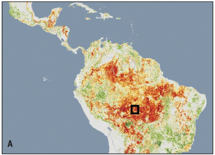
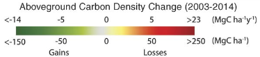

# Above Ground Carbon Density Change, 2003–2014

**Source:** Baccini et al., 2017

## What this indicator measures

Spatial distribution of areas exhibiting gains, losses, and no change in above-ground carbon density. Values represent the change from 2003 to 2014 within each 463m x 463m grid cell.

## Key finding

In Brazil, decreasing losses in carbon density early in the time series corresponds to policy interventions to reduce deforestation. Carbon source areas are concentrated in the south and east of the Amazon.

## Visual

## Full reference

Baccini, A., Walker, W., Carvalho, L., Farina, M., Sulla-Menashe, D., & Houghton, R. A. (2017). Tropical forests are a net carbon source based on aboveground measurements of gain and loss. *Science*, *358*(6360), 230–234. https://doi.org/10.1126/science.aam5962
